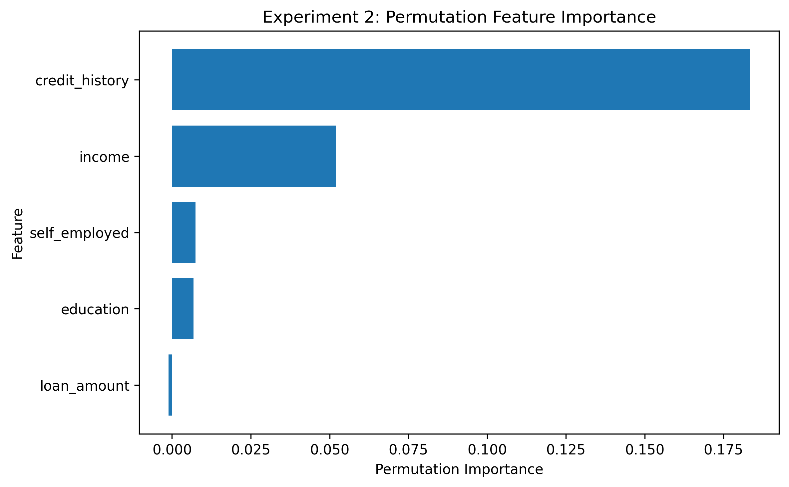
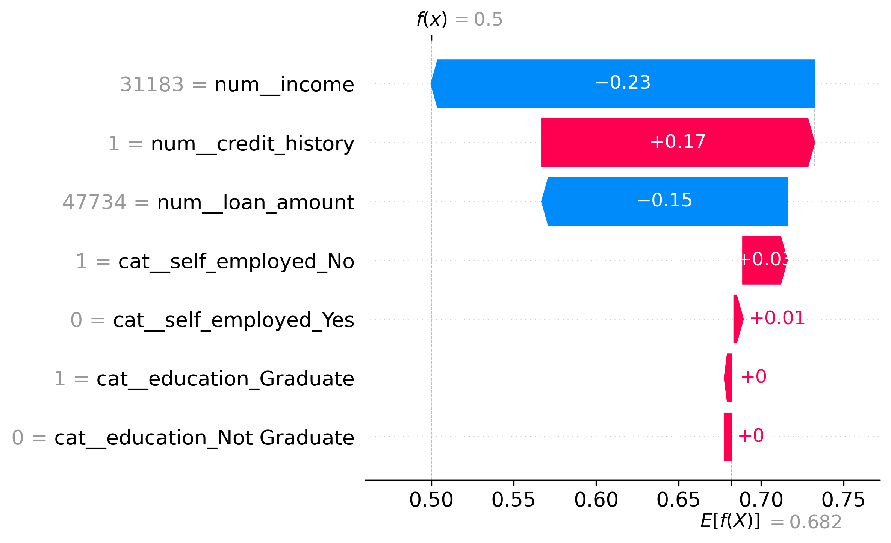
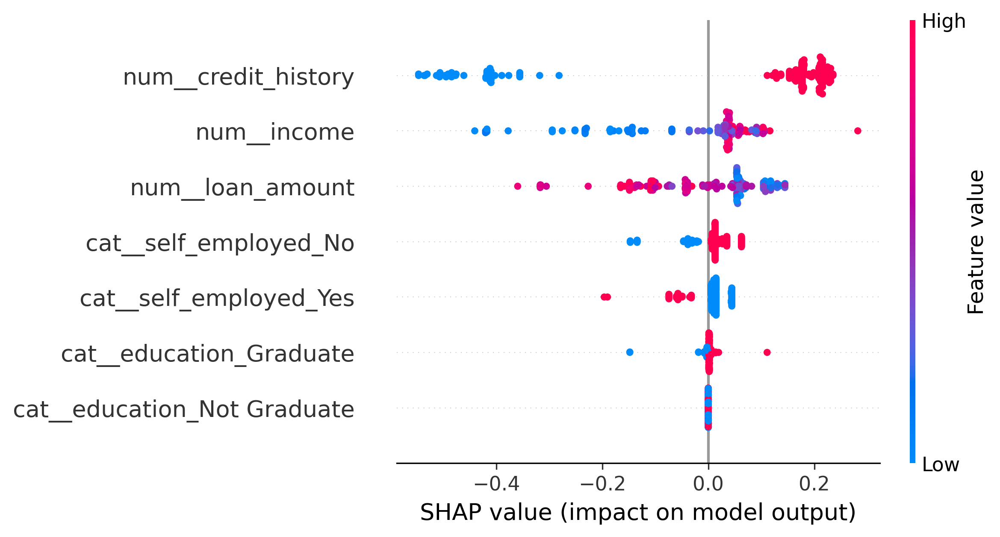

# Explainable Loan Approval Prediction Using Machine Learning

This project explores how Explainable Artificial Intelligence (XAI) can be used to understand the predictions of a machine-learning classification model. A Decision Tree classifier is trained on a synthetic loan-approval dataset, and its predictions are analyzed using **Permutation Importance** and **SHAP (SHapley Additive exPlanations)**.

The project focuses not only on predictive performance, but also on understanding **which features influence the model globally and why the model makes specific individual predictions**.

---

## Project Overview

Machine-learning models can produce accurate predictions while providing limited insight into how those predictions were reached. This becomes especially important in decision-making applications where model behavior needs to be examined and understood.

This project investigates three main questions:

- Which features does the model rely on most strongly overall?
- Why does the model approve or reject a particular applicant?
- Do different explainability techniques provide similar conclusions about model behavior?

A synthetic dataset is used so that the complete experimental process can be controlled and reproduced.

---

## Dataset and Experimental Design

The synthetic dataset contains **700 observations** and five input features:

| Feature | Description |
|---|---|
| `income` | Applicant income |
| `loan_amount` | Requested loan amount |
| `credit_history` | Binary credit-history indicator |
| `education` | Graduate or Not Graduate |
| `self_employed` | Self-employment status |

The target variable is `approved`, where:

- `1` = Approved
- `0` = Rejected

### Experiment 1: Initial Dataset

The initial data-generation process produced:

- **686 approved**
- **14 rejected**

Although the resulting model achieved approximately **98% accuracy**, inspection of the class distribution revealed severe imbalance. The high accuracy therefore provided a misleading picture of model performance.

### Experiment 2: Improved Class Distribution

The synthetic target-generation process was adjusted to create a more informative class distribution:

- **477 approved (68.14%)**
- **223 rejected (31.86%)**

Experiment 2 was used for the final model evaluation and XAI analysis.

---

## Machine-Learning Model

The final model uses a **Decision Tree classifier** within a scikit-learn preprocessing pipeline.

Key configuration:

- 75% training / 25% testing
- Stratified train-test split
- One-hot encoding for categorical variables
- Decision Tree with `max_depth=4`
- `random_state=42`

The final test set contains **175 observations**.

---

## Model Performance

The final Experiment 2 model achieved the following test results:

| Metric | Result |
|---|---:|
| Accuracy | **80.0%** |
| Rejected Precision | 0.67 |
| Rejected Recall | 0.75 |
| Rejected F1-score | 0.71 |
| Approved Precision | 0.88 |
| Approved Recall | 0.82 |
| Approved F1-score | 0.85 |

Confusion matrix:

```text
[[42, 14],
 [21, 98]]
```

Although the final accuracy is lower than the approximately 98% obtained in Experiment 1, it provides a more meaningful evaluation because Experiment 2 contains substantially more rejected observations and allows performance on both classes to be examined.

---

## Explainable AI Analysis

Two complementary XAI approaches are used to investigate the trained model.

### Permutation Importance

Permutation Importance measures how model performance changes when the values of individual features are randomly shuffled.

The analysis identified:

1. **Credit history**
2. **Income**

as the two most influential features globally.





### SHAP

SHAP explains how individual feature values contribute to model predictions relative to a baseline model output.

Three local prediction cases were investigated:

- **Confident rejection**
- **Confident approval**
- **Borderline prediction**

The borderline case was particularly useful because positive and negative feature contributions competed with one another, resulting in an approval probability of exactly **0.50**.



Global SHAP analysis was also performed across all **175 test observations** using mean absolute SHAP values and a SHAP beeswarm visualization.



---

## Permutation Importance vs. SHAP

The two XAI methods produced the following global feature rankings:

| Feature | Permutation Rank | SHAP Rank |
|---|---:|---:|
| Credit History | 1 | 1 |
| Income | 2 | 2 |
| Loan Amount | 5 | 3 |
| Self Employed | 4 | 4 |
| Education | 3 | 5 |

Both methods identified **credit history as the most important feature** and **income as the second most important feature**.

Differences among the remaining features demonstrate that explainability techniques do not necessarily measure feature importance in the same way. Permutation Importance evaluates model dependence through changes in predictive performance, while SHAP measures contributions to individual model outputs.

---

## Key Findings

- High classification accuracy can be misleading when target classes are severely imbalanced.
- Credit history was the strongest global feature according to both XAI methods.
- Income was consistently ranked as the second most influential feature.
- Global feature importance does not necessarily determine which feature dominates an individual prediction.
- SHAP reveals both the magnitude and direction of individual feature contributions.
- Permutation Importance and SHAP provide complementary perspectives on model behavior.

---

## Project Structure

The final repository will be organized approximately as follows:

```text
xai_project/
│
├── xai_loan_project.ipynb
├── README.md
├── requirements.txt
├── .gitignore
│
├── figures/
│   ├── permutation_importance.png
│   ├── shap_beeswarm.png
│   ├── shap_rejection.png
│   ├── shap_approval.png
│   ├── shap_borderline.png
│   └── xai_ranking_comparison.png
│
└── paper/
    └── xai_loan_project_report.pdf
```

The Jupyter notebook contains the complete experiment, including synthetic data generation, model development, evaluation, XAI analysis, visualizations, and detailed interpretation.

---

## Running the Project

Clone the repository and enter the project directory:

```bash
git clone <repository-url>
cd xai_project
```

Create a virtual environment:

```bash
python3 -m venv venv
```

Activate it on macOS/Linux:

```bash
source venv/bin/activate
```

Install the required dependencies:

```bash
pip install -r requirements.txt
```

Start Jupyter Notebook:

```bash
jupyter notebook
```

Open `xai_loan_project.ipynb` and run the notebook from top to bottom.

---

## Technologies

- Python
- NumPy
- pandas
- scikit-learn
- SHAP
- Matplotlib
- Jupyter Notebook

---

## Limitations

This project uses **synthetic data** and a limited set of applicant features. The results demonstrate the behavior of the experimental machine-learning model and should not be interpreted as findings about real-world lending decisions.

SHAP and Permutation Importance explain the behavior of the trained model; they do **not establish causal relationships** between applicant characteristics and loan outcomes.

---

## Future Work

Possible extensions include:

- evaluating the approach on a public real-world dataset
- comparing Decision Trees with Random Forest, Gradient Boosting, or other models
- using cross-validation and hyperparameter optimization
- investigating additional XAI techniques
- performing model fairness and bias analysis
- studying the stability of explanations across different models and datasets

---

## Reproducibility

A fixed random state is used where appropriate to make the experiment reproducible. The completed notebook has also been tested by restarting the Jupyter kernel and running all cells sequentially without errors.

---

## Disclaimer

This project was developed for **educational and research purposes*This project was developed for **educational and research purposes**. It is not a real lending decision system and should not be used to make financial or credit decisions.
